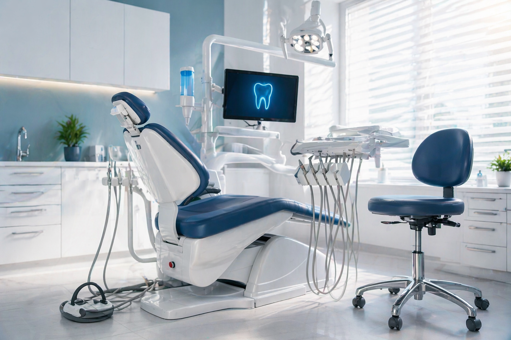

# Nova Smile Clinic



A responsive dental clinic website concept designed to present cosmetic, restorative, and preventive treatments clearly while building patient trust and encouraging consultation enquiries.

## Live Demo

[View Nova Smile Clinic](https://donmarcoflorini-art.github.io/nova-smile-clinic/)

## Project Overview

Nova Smile Clinic is a fictional dental clinic website created as a portfolio project for clinics, dentists, and medical tourism businesses.

The website focuses on clear service presentation, professional visual design, patient reassurance, and strong consultation calls to action.

## Project Goals

The project was created to demonstrate how a modern clinic website can:

* Present dental services clearly
* Build credibility and patient trust
* Explain treatment benefits without overwhelming visitors
* Guide users toward booking a consultation
* Work smoothly across desktop and mobile devices
* Create a professional first impression for a healthcare business

## Main Sections

* Hero section
* Clinic trust statistics
* About the clinic
* Dental services
* Before-and-after results concepts
* Doctor profiles
* Consultation call to action
* Contact and booking section

## Dental Services Presented

* Smile Design
* Veneers and Crowns
* Dental Implants
* Teeth Whitening
* General Dentistry
* Consultation and Treatment Planning

## Key Features

* Responsive one-page layout
* Mobile-friendly design
* Clear navigation structure
* Professional healthcare visual style
* Service cards
* Trust and statistics section
* Treatment result presentation
* Doctor profile cards
* Consultation call-to-action sections
* Contact information section
* Search engine description metadata
* GitHub Pages deployment

## Design Direction

The visual direction combines:

* Clean medical presentation
* Calm and professional typography
* Strong spacing and content hierarchy
* Trust-focused messaging
* Clear calls to action
* Modern clinic imagery

The design avoids an overly technical or intimidating medical appearance and instead creates a clean, approachable patient experience.

## Technologies

* HTML5
* CSS3
* JavaScript
* Responsive Web Design
* Git and GitHub
* GitHub Pages

## Project Structure

```text
/
├── index.html
├── style.css
├── script.js
└── images/
    └── nova-hero.png
```

## Responsive Design

The website was designed to adapt across:

* Desktop screens
* Laptops
* Tablets
* Mobile phones

The layout, navigation, cards, images, buttons, and content spacing were adjusted for smaller screens.

## Future Improvements

The current project can be expanded with:

* Functional WhatsApp integration
* Online consultation form
* Appointment booking system
* Real doctor profiles
* Real patient reviews
* Treatment detail pages
* Before-and-after image galleries
* Multilingual support
* SEO and social sharing metadata
* Google Maps integration

## Disclaimer

Nova Smile Clinic is a fictional portfolio project.

The clinic name, doctors, statistics, contact information, treatments, images, and medical claims are used only for design and development demonstration purposes.

This website does not represent a real clinic or provide medical advice.

## Author

Designed and developed by **Nabil Quwatli**.

[View My GitHub Profile](https://github.com/donmarcoflorini-art)
[View My Portfolio](https://donmarcoflorini-art.github.io/)
